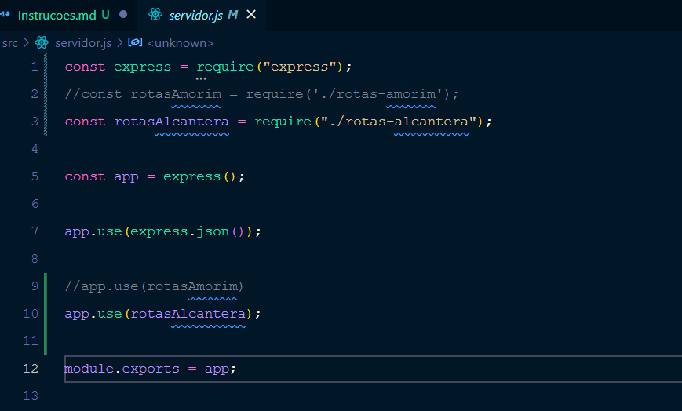

# desafio-backend-modulo-04-sistema-bancario-ddst11-instruções

Para evitar o maximo de conflitos, criei dois arquivos de controladores e dois de rotas para cada um trabalhar na suas funcionalidades.
Quando estivermos finalizando, juntamos tudo em apenas um arquivo de controladores e de rotas.
O arquivo de servidor é unico e se você reparar vamos trabalhar da mesma forma que estavamos no desafio de frontend.

## Observações

- Quando o outro precisa fazer um git push, ele comenta a sua rota.
- Vamos pradonizar o comentário com duas barras
